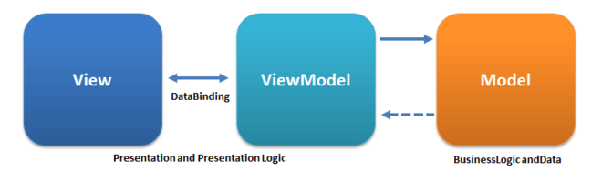

# Vue 的进阶学习

### ViewModel 的理解

曾经没有 MVVM 框架的年代，写 JavaScript 做动态的网页是一件非常繁琐的事情，浏览器虽然提供了一套操作 DOM 的 API，但十分难用。比如我要监听一个输入框的变化，然后取它的值，我得这么写代码。

...(代码示例)

而如今，我们在使用 Vue 框架的时候，我们都会在每个 Vue 的组件中定义 data 对象，再将其中的属性通过模板语法绑定在 HTML 中，当 data 中值发生改变的时候，则视图会做出相应的变化。


通过 ViewModel 和 View 上的 DOM 元素绑定的思想，我们再也不需要通过反复调用 DOM 的 API 来操作 DOM 元素了，如此神奇的操作，我们不禁要发问，是如何实现的呢？

在 Vue 中，每个实例都有一个 Watcher 实例，它会监听 data 对象属性的变化，并通知渲染层进行视图的重新渲染。

需要注意的是，在 Vue 中，数组的变化难以被检测。目前，Vue 只能检测数组的一些特定方法，当然，当数组被重新赋值的时候，也会被检测到。

而在我们平时的开发中，我们可能会经常遇到以下情况。

...(代码示例)

### 组件之间的数据流

一般而言，Vue 当中的组件之间的通信主要通过以下两种方式

- 父组件->子组件

  props

  > - 使用 props 传递参数，当父组件的传递的    props 值发生变化时，子组件中绑定的视图也会发生变化，但这并不以为着子组件会重新开始它的生命周期。
  > - props 的传递是单向的，在子组件中，无法直接修改 props 的值。

  ...（代码示例)

- 子组件->父组件

  $emit, $on

